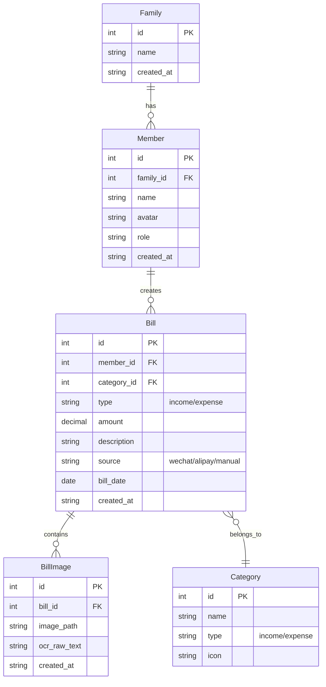
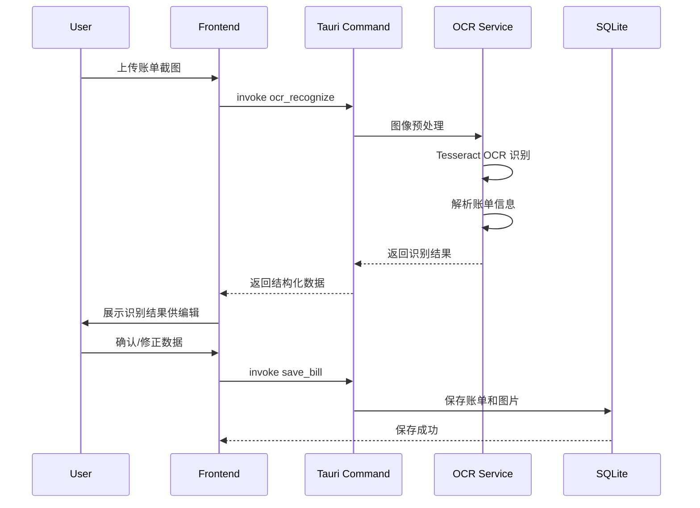

# 家庭账单收支管理 APP 设计方案

## 项目概述

使用 Tauri 2.0 + Rust 构建跨平台（桌面端 + 移动端）的家庭账单收支管理应用，支持 OCR 辅助识别微信/支付宝账单截图，本地存储数据并提供导入导出功能。

## 开发进度

| 任务 | 状态 |
|------|------|
| 初始化 Tauri 2.0 项目并配置 Vue 3 + TypeScript 前端 | ✅ 已完成 |
| 设计并初始化 SQLite 数据库表结构 | ✅ 已完成 |
| 实现家庭和成员管理的 CRUD 功能 | ✅ 已完成 |
| 实现账单管理功能（添加/编辑/删除/列表） | ✅ 已完成 |
| 集成 OCR 引擎并实现账单截图识别解析 | ✅ 已完成 |
| 实现收支统计和 ECharts 数据可视化 | ✅ 已完成 |
| 实现数据导入导出功能（JSON/Excel） | ✅ 已完成 |
| 移动端 UI 适配和响应式优化 | ✅ 已完成 |

---

## 技术架构

```mermaid
graph TB
    subgraph frontend [前端 - Vue 3 + TypeScript]
        UI[用户界面]
        Charts[ECharts 图表]
        ImagePreview[图片预览组件]
    end
    
    subgraph tauri [Tauri 2.0 桥接层]
        Commands[Rust Commands]
        Events[事件系统]
        FileSystem[文件系统 API]
    end
    
    subgraph backend [Rust 后端]
        OCR[OCR 识别模块]
        DataService[数据服务层]
        ExportImport[导入导出模块]
    end
    
    subgraph storage [数据存储]
        SQLite[(SQLite 数据库)]
        ImageStore[图片存储目录]
    end
    
    UI --> Commands
    Charts --> Commands
    Commands --> OCR
    Commands --> DataService
    Commands --> ExportImport
    DataService --> SQLite
    OCR --> ImageStore
    DataService --> ImageStore
```



---

## 核心功能模块

### 1. 家庭与成员管理

- 创建家庭账户（本地主账户概念）
- 添加/编辑/删除家庭成员
- 成员角色：管理员、普通成员
- 每个成员关联各自的账单记录

### 2. 账单截图 OCR 识别

- 支持上传微信/支付宝账单截图
- 使用 Rust OCR 库（`rusty-tesseract`）进行图像文字识别
- 自动解析账单中的关键信息：
  - 收支类型（收入/支出）
  - 金额
  - 交易时间
  - 交易对象/备注
- 识别结果展示，用户可手动修正

### 3. 账单管理

- 手动添加/编辑/删除账单记录
- 账单分类（餐饮、交通、购物、工资、转账等）
- 截图附件关联保存
- 按成员、月份、类别筛选

### 4. 收支统计与可视化

- 家庭月度收支汇总
- 按成员分组的收支明细
- 支出分类占比饼图
- 月度收支趋势折线图
- 年度收支对比柱状图

### 5. 数据导入导出

- 导出格式：JSON、Excel（xlsx）
- 导出内容：账单数据 + 图片附件打包
- 导入数据并合并（去重处理）

---

## 数据库设计



---

## 页面结构设计

```
/
├── 首页仪表盘 (Dashboard)
│   ├── 本月收支概览卡片
│   ├── 收支趋势图
│   └── 最近账单列表
│
├── 账单管理 (Bills)
│   ├── 账单列表（筛选/搜索）
│   ├── 添加账单（手动输入）
│   └── 截图识别（OCR 上传）
│
├── 统计分析 (Statistics)
│   ├── 月度报表
│   ├── 分类统计
│   └── 成员对比
│
├── 家庭管理 (Family)
│   ├── 成员列表
│   ├── 添加/编辑成员
│   └── 分类管理
│
└── 设置 (Settings)
    ├── 数据导出
    ├── 数据导入
    └── 应用设置
```

---

## 项目目录结构

```
Household_Billing_Expense_Management_System/
├── src-tauri/                    # Rust 后端
│   ├── src/
│   │   ├── main.rs              # 入口文件
│   │   ├── lib.rs               # 库入口
│   │   ├── commands/            # Tauri 命令
│   │   │   ├── mod.rs
│   │   │   ├── family.rs        # 家庭相关命令
│   │   │   ├── member.rs        # 成员相关命令
│   │   │   ├── bill.rs          # 账单相关命令
│   │   │   ├── ocr.rs           # OCR 相关命令
│   │   │   ├── image.rs         # 图片上传命令
│   │   │   ├── statistics.rs    # 统计命令
│   │   │   └── export.rs        # 导入导出命令
│   │   ├── models/              # 数据模型
│   │   │   ├── mod.rs
│   │   │   ├── family.rs
│   │   │   ├── member.rs
│   │   │   ├── bill.rs
│   │   │   └── category.rs
│   │   ├── services/            # 业务逻辑
│   │   │   ├── mod.rs
│   │   │   ├── database.rs      # 数据库服务
│   │   │   ├── ocr_service.rs   # OCR 服务
│   │   │   └── export_service.rs
│   │   └── utils/               # 工具函数
│   ├── Cargo.toml
│   └── tauri.conf.json
│
├── src/                          # Vue 3 前端
│   ├── main.ts
│   ├── App.vue
│   ├── assets/
│   ├── components/              # 通用组件
│   │   ├── BillCard.vue
│   │   ├── NavBar.vue
│   │   └── ...
│   ├── views/                   # 页面视图
│   │   ├── Dashboard.vue
│   │   ├── Bills.vue
│   │   ├── Statistics.vue
│   │   ├── Family.vue
│   │   └── Settings.vue
│   ├── stores/                  # Pinia 状态管理
│   │   ├── bill.ts
│   │   └── family.ts
│   ├── api/                     # Tauri 命令封装
│   │   └── tauri.ts
│   ├── utils/                   # 工具函数
│   │   ├── validation.ts
│   │   └── errorHandler.ts
│   └── types/                   # TypeScript 类型
│       └── index.ts
│
├── design/                       # 设计文档
├── package.json
├── vite.config.ts
└── README.md
```

---

## 关键技术选型

| 模块 | 技术方案 |
|------|---------|
| 跨平台框架 | Tauri 2.0 |
| 后端语言 | Rust |
| 前端框架 | Vue 3 + TypeScript + Vite |
| UI 组件库 | Vant 4 (移动端兼容) |
| 图表库 | ECharts |
| 本地数据库 | SQLite (via rusqlite) |
| OCR 引擎 | rusty-tesseract + 预处理优化 |
| 数据导出 | rust-xlsxwriter (Excel) / serde_json (JSON) |
| 状态管理 | Pinia |

---

## OCR 识别流程



---

## 开发阶段规划

### 阶段一：项目初始化与基础架构 ✅

- Tauri 2.0 项目初始化（支持桌面 + 移动端）
- Vue 3 前端脚手架搭建
- SQLite 数据库初始化与迁移
- 基础 UI 框架和路由配置

### 阶段二：核心功能开发 ✅

- 家庭/成员 CRUD 功能
- 账单手动添加/编辑/删除
- 账单列表与筛选
- 基础统计展示

### 阶段三：OCR 功能集成 ✅

- Tesseract OCR 集成
- 微信/支付宝账单模板解析
- 图片预处理优化识别率
- OCR 结果编辑确认界面

### 阶段四：数据可视化与导入导出 ✅

- ECharts 图表集成
- 月度/年度报表
- JSON/Excel 导出功能
- 数据导入与合并

### 阶段五：优化与发布 ✅

- 移动端 UI 适配
- 性能优化
- 应用打包与发布

---

## 注意事项

1. **OCR 准确率**：微信/支付宝账单格式相对固定，可针对性优化解析规则
2. **数据安全**：所有数据存储在本地，不涉及云端同步
3. **跨平台兼容**：UI 需要适配桌面端和移动端不同屏幕尺寸
4. **性能优化**：大量账单数据时需要分页加载和虚拟滚动

---

## 运行说明

```bash
# 安装依赖
npm install

# 开发模式运行
npm run tauri:dev

# 构建生产版本
npm run tauri:build
```

